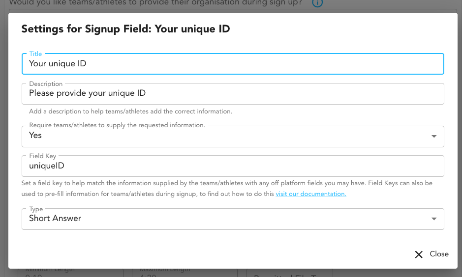

# License Verification Platform Technical Documentation
The purpose of this document is to provide documentation for concepts relating to the [License Verification Platform](https://verification.clicknclear.com) that do not fall under the API documentation.

## Signup Fields and Signup Keys
When setting up a season or event you may want to collect custom data during signup.

To collect this data we recommend using Signup fields, which can be found on the season edit / event edit pages.
When setting up a Signup field, you will notice the input 'Field Key'.

Field keys can be used to identify certain fields between any season/event that you may be running.

Our API endpoints will return the entries along with any signup field answers and the associated field keys (if set).
You then can use the field keys to map the answers into your own systems data types.

Field keys can also be used to auto-fill the signup form with any information you may have on your system.
For example, say you have a unique ID for each entry you're expecting. You could use a signup field and signup field key to capture this information during signup:


To auto-fill a signup field for your entrants, update the signup url to have an additional query parameter where the key is your field key and the value is the information you want to be auto-filled.
In the uniqueID example, for an event, it would look like this:
```
https://verification.clicknclear.com/my-events/event/1/invite?token=e175e0c9e5d73fe2c2574c83b1e1d5dd&uniqueID=12345678
```
If you want to auto-fill the default email and name fields you can do that by providing the entryName & entryEmail query parameters.
For example:
```
https://verification.clicknclear.com/my-events/event/1/invite?token=e175e0c9e5d73fe2c2574c83b1e1d5dd&uniqueID=12345678&entryName=Tristan&entryEmail=tristan@clicknclear.com
```
### Limitations
Depending on the values you use for auto-filling, you may need to encode your values to be URI compatible.
Additionally there are some keys that cannot be used as Signup Field Keys.
They are:
- `referrerURL`
- `token`
- `entryEmail`
- `entryName`

If you need further support please reach out to [techteam@clicknclear.com](mailto:techteam@clicknclear.com)

## Recording Filename Template
The recording filename template can be used to automatically convert the user entered filenames into your own file name structure.
Here is an example of a valid filename template:

`{{division}}_{{countryCode}}_{{entryName}}`

The value in the {{}} can be either a signup field key or 'entryName' where entry name is the name of the Team/Athlete.
The entire `{{..}}` will be replaced with the corresponding answer from the matching signup field.
For example if a team called "Tigers" answered the signup fields as follows:
```
{
  "division": "Open",
  "countryCode": "US"
}
```

With a recording template of: `{{division}}_{{countryCode}}_{{entryName}}`
The resulting file name would be: `Open_US_Tigers.mp3`

### *WARNING!*
Do not add the file extension on the end of the filename, the correct file extension will be applied automatically.
